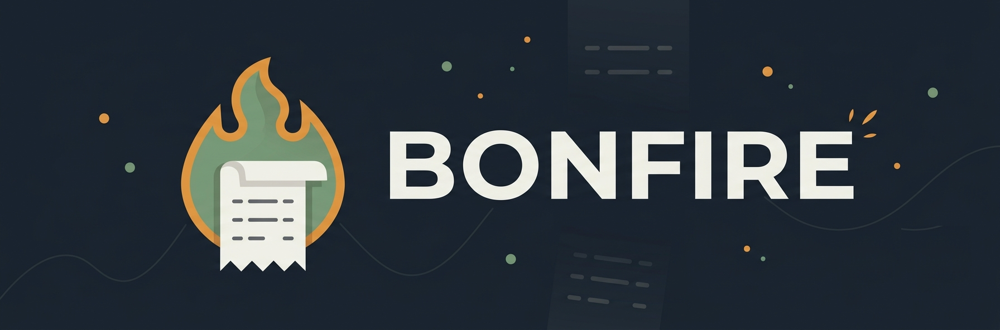
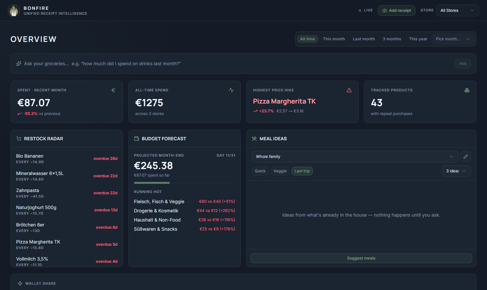
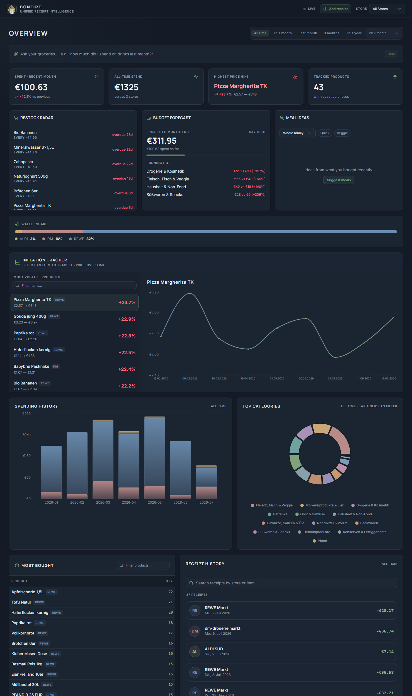

<p align="center">
  
</p>

# Bonfire

Turn a mailbox full of German supermarket receipts (*Bons*) into a spending
dashboard.

Scrapes REWE eBons from email, ingests DM eBons and photographed receipts from
any store, parses them into SQLite, categorizes every line item with an LLM,
and serves analytics on a self-hosted dashboard — designed to run unattended on
a Raspberry Pi.

[](https://github.com/Naxter/bonfire/actions/workflows/ci.yml)




<details>
<summary>Full dashboard screenshot</summary>



</details>

## Features

- **Automatic ingest** — an IMAP scraper pulls REWE eBon PDFs from your inbox
  on a schedule; a folder watcher ingests anything you drop into
  `backend/data/inbox/` (PDF or photo) within seconds.
- **Any store via photos** — receipts from stores without an adapter
  (Aldi, Lidl, the bakery) are photographed and structured by a multimodal
  LLM; new stores appear in the dashboard filter automatically.
- **LLM categorization with a cache** — every line item is filed into a
  German grocery taxonomy once, then remembered. Manual overrides are locked
  and never overwritten.
- **Restock radar** — predicts what you're about to run out of, from your own
  purchase cadence.
- **Budget forecast** — projects month-end spend from the current pace and
  flags categories running hot vs. their history.
- **Inflation tracker** — per-product price history and the biggest price
  hikes across your receipts.
- **Ask your groceries** — natural-language questions ("how much did I spend
  on drinks last month?") become guarded, read-only SQL.
- **Meal ideas** — recipe suggestions from what's already in the house
  (your latest shopping trip per store), with cooking time, what's still
  missing, and 1-year-old adaptations. The prompts behind the built-in
  adult / toddler / family profiles are editable, and you can add your own
  profiles right in the dashboard.
- **Telegram bot** — snap a photo of a receipt to file it; `/restock`,
  `/budget`, `/meals`, or plain-language questions from your phone.
- **Pluggable LLM** — Ollama (local), OpenAI, or Gemini. Drop an API key in
  `.env` and the provider is auto-detected; swap with one line.

## How it works

```
email-scraper/   -> downloads REWE eBon PDFs from your mailbox (IMAP)
        |
        v
backend/data/inbox/*.pdf|*.jpg
        |
  watch_inbox.py ──> app/ingest.py ──> app/stores/<store>.py (detect + parse)
        |                                       |
        |                                 normalized ParsedReceipt
        v                                       v
   SQLite (WAL)  <── categorizer (LLM) ── items + receipts
        |
        v
   FastAPI (app/main.py)  ──>  Next.js dashboard
```

Store parsing is adapter-based: REWE eBons are parsed from their PDF text
layer, DM eBons are structured by the LLM, photos go through the vision
model. Receipts are deduplicated by content hash, so re-downloads and renames
are harmless.

## Quickstart (with demo data)

Prerequisites: Python 3.10+, Node 18+.

```sh
# Backend
cd backend
pip install -r requirements.txt
python seed_demo.py                    # ~6 months of synthetic receipts, no API key needed
uvicorn app.main:app --reload          # http://localhost:8000

# Frontend (second terminal)
cd frontend
npm install
npm run dev                            # http://localhost:3000
```

Open http://localhost:3000 and you get the dashboard above. Delete
`backend/data/bonfire.db` when you're ready to start with your own receipts.

## Using your own receipts

1. **Configure:** `cp .env.example .env` and fill in what you use. Setting
   `OPENAI_API_KEY` *or* `GEMINI_API_KEY` is enough to pick the LLM — or run a
   local [Ollama](https://ollama.com) with `LLM_PROVIDER=ollama`. Verify with
   `python check_llm.py`.
2. **Import:** drop receipt PDFs (or photos) into `backend/data/inbox/` and
   run `python process_backlog.py` — or keep `python watch_inbox.py` running
   and files are ingested the moment they land.
3. **Automate REWE:** forward your eBon mails to a mailbox the scraper can
   read (GMX credentials in `.env`), then run `email-scraper/scraper.py` on a
   schedule. DM offers no comparable automation — download the eBon PDF from
   the DM app/website (or photograph the paper receipt) and drop it into
   `backend/data/inbox/dm/`.

## Adding a new store

The pipeline is store-agnostic. To support a new chain (e.g. Lidl):

1. Create `backend/app/stores/lidl.py` with a `StoreAdapter` subclass
   implementing `matches(text, filename)` and `parse(file_path, text)` →
   returns a normalized `ParsedReceipt` (see `stores/base.py`).
2. Register it in `backend/app/stores/registry.py` by adding it to `ADAPTERS`.

That's it. Ingestion, the `store_key` column, every stats endpoint, and the
frontend store filter are all driven off the registry — no other file changes.
(There's a test asserting exactly this.)

## Deployment

Two supported paths for an always-on box (Raspberry Pi OS 64-bit or any
Linux host):

- **systemd** — services + timers, lightest on resources:
  [deploy/DEPLOY.md](deploy/DEPLOY.md)
- **Docker Compose** — one ops model for everything:
  [deploy/DOCKER.md](deploy/DOCKER.md)

## Security & scope

This is a **single-user app designed to run on a trusted home LAN**. It has
**no authentication** — anyone who can reach the host on your network can read
the dashboard and API. That is intentional for a personal tool. **Do not
expose it to the internet** (no port-forwarding, no public tunnel) without
first putting it behind an authenticating reverse proxy (e.g. Caddy or nginx
with Basic Auth + TLS). The services bind to `0.0.0.0` so other devices on
your WiFi (your phone) can reach them; this is required for normal use.

## Development

```sh
pip install pytest ruff
(cd backend && pytest -q)              # unit tests (in-memory DB, LLM stubbed)
ruff check .                           # lint, config in pyproject.toml

(cd frontend && npm run lint)
```

The database schema and lightweight migrations are applied automatically on
API startup and by `process_backlog.py` — there is no migration tool to run.

CI runs the same checks on every push and PR
([.github/workflows/ci.yml](.github/workflows/ci.yml)). A self-hosted box can
auto-deploy commits whose CI is green — see the CD section in
[deploy/DOCKER.md](deploy/DOCKER.md).

## License

[MIT](LICENSE)
